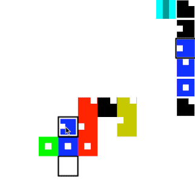

# Cross Set

A game of arranging colored tiles into crosses to form sets.

## Rules:

By placing tiles, form lines that either
a) have all the shame shape, but distinct colors (no repeats!)
b) have all the same color, but distinct shapes (no repeats)

Placing more tiles at once gets you more points.
(exact scoring TBD).

## Controls:

- Your "hand" is down the right hand side.
- Click to select a tile.
- cmd-click another tile to swap those tiles
- shift-click another tile to select several tiles
- toggle placement direction (down or to the right) via the blue button

If the selected tiles can be placed, the valid placements will higlight with a black border. Click the place to lay down the tiles.

This will eventually be multiplayer, and probably hosted on glitch or somewhere.
